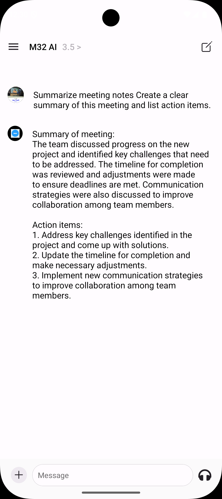

# M32 AI – React Native Chatbot Project

This project is built as part of the **M32 React Native role assignment**.  
It delivers a **mobile chatbot application** powered by Large Language Models (LLMs) with context retention, a modern UI, and business-focused use cases.

---

## 📱 Features

- **User Authentication**
  - Sign up, login, logout
  - Google OAuth support
  - Add API Keys

- **Chatbot**
  - Context-aware conversations within a single session
  - Powered by [OpenAI](https://platform.openai.com/)
  - Supports tool integrations (e.g., research, citations, business copilots)

- **UI/UX**
  - Built with **React Native** + **Expo**
  - Optimized for users aged 35+, non-technical business owners
  - Clean, simple, production-ready design
  - Smooth animations and gesture support

- **Persistence**
  - Local storage of chat history (SQLite / MMKV)
  - Session management with Clerk/Auth provider

- **Scalable Backend**
  - Extendable for APIs and multi-agent systems

- **Additional Enhancements**
  - Business use case example: Invoice Copilot / HR Copilot
---

## 🛠️ Tech Stack

- **Framework:** React Native **0.81.4** with **Expo SDK 54**
- **Navigation:** Expo Router, React Navigation (Drawer, Tabs)
- **Animations:** Reanimated 4, Gesture Handler, Redash, Worklets
- **Auth:** Clerk (with Google OAuth support via `expo-auth-session`)
- **AI/LLM:** OpenAI GPT APIs 
- **Storage:** SQLite (`expo-sqlite`) & MMKV for high-performance local storage
- **UI/UX Libraries:**
  - Bottom Sheet (Gorhom)
  - FlashList (Shopify)
  - Shimmer Placeholder
  - Image Zoom
  - Zeego menus
---
## ⚙️ Project Setup

### 1. Clone Repo
```bash
git clone https://github.com/YOUR_GITHUB/m32-chatflow-ai.git
cd m32-chatflow-ai
```
### 2. Install Dependencies
```bash
npm install
```
### 3. Environment Variables

Create a .env file in the root with the following:
```bash 
EXPO_PUBLIC_CLERK_PUBLISHABLE_KEY=pk_test_
CLERK_SECRET_KEY=sk_test_
EXPO_PUBLIC_RC_GOOGLE_KEY=goog_
```
### 4. Run App
```bash
npx expo start
```
---

## 📦 Deliverables

•	📱 APK build (Android) or demo video [APK & Demo Video](https://drive.google.com/drive/folders/1LMKE-bBusL4DbUrDJn6I1H4BRHIr1fnQ?usp=drive_link) <br/>
•	🎥 [Demo video showcasing core features](https://drive.google.com/drive/folders/1LMKE-bBusL4DbUrDJn6I1H4BRHIr1fnQ?usp=drive_link)

## 📸 Screenshots & Demo

<div style="display: flex; flex-direction: 'row';">





</div>

<div style="display: flex; flex-direction: 'row';">


</div>

## 🎯 Evaluation Focus

This project demonstrates:

	1.	Creativity & Beyond Basics – added business use case, clean UX
	2.	Autonomy – self-built from scratch with minimal oversight
	3.	Product Thinking – usable by real-world SMB decision-makers

---

## 🧑‍💻 Author

Developed by [Chirag ❤️](https://github.com/hellochirag)
As part of the M32 AI Interview Project

## Learn more

To learn more about developing your project with Expo, look at the following resources:

- [Expo documentation](https://docs.expo.dev/): Learn fundamentals, or go into advanced topics with our [guides](https://docs.expo.dev/guides).
- [Learn Expo tutorial](https://docs.expo.dev/tutorial/introduction/): Follow a step-by-step tutorial where you'll create a project that runs on Android, iOS, and the web.